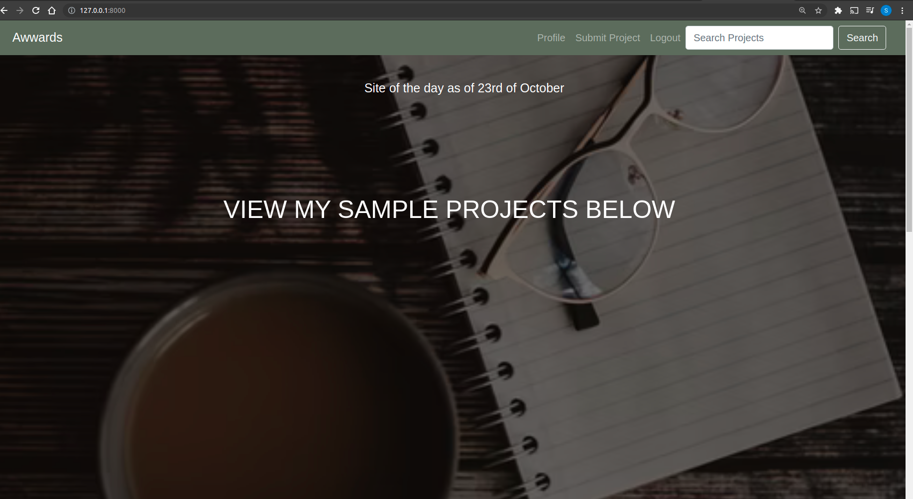
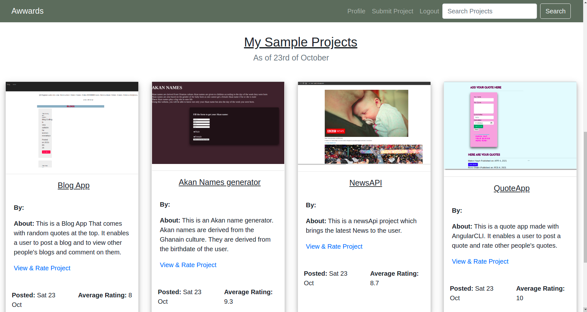

## Awwards Project
This Awwards web application serves mainly to enable on to view my projects and rate them. It also enables one to post their own projects after signing up for an account. 

## screenshot-images
   

## Author 
* Shalin Rono

##### Built With

- Python3.8 

- Django3.2.8

- Bootstrap4

- CSS

### Prerequisites
* Create and activate Virtual env then install pip
* To install django -pip install django LTS
* Have basic git knowledge

### Installation

1. Clone the repository
   
   git clone https://github.com/sha-lin/awwards

2. Install the latest django version and other requirements in my requirements.txt file

## Usage

The user should view the projects on the landing page and also be able to upload their own projects.

## Contributing
Any contributions you make are **greatly appreciated**.

If you have a suggestion that would make this better, please fork the repo and create a pull request. 

1. Fork the Project
2. Create your Feature Branch (`git checkout -b feature/AmazingFeature`)
3. Commit your Changes (`git commit -m 'Add some AmazingFeature'`)
4. Push to the Branch (`git push origin feature/AmazingFeature`)
5. Open a Pull Request

## Contact Information
E_MAIL -ronoshalin@gmail.com

Project Link: [https://github.com/sha-lin/awwards](https://github.com/sha-lin/awwards)
## License
https://github.com/sha-lin/awwards/blob/master/LICENSE
# **Copyright**
Copyright (c) {2021} **SHALIN RONO**